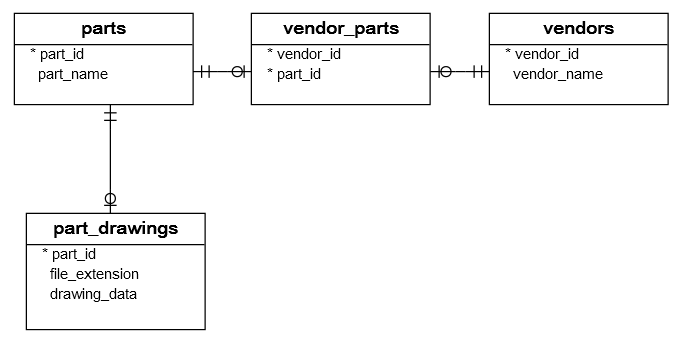

# PostgreSQL Python

This PostgreSQL Python section shows you how to work with the PostgreSQL database using the Python programming language.

Python has various database drivers for PostgreSQL. Currently, the **psycopg** is the most popular PostgreSQL database adapter for the Python language. The **psycopg** fully implements the Python DB-API 2.0 specification.

The current version of the psycopg is 2 or **psycopg2**. The psycopg2 database adapter implemented in C as a libpq wrapper resulting in both fast and secure. The psycopg2 provides many useful features such as client-side and server-side cursors, asynchronous notification and communication, COPY command support, etc.

Besides, the **psycopg2** driver supports many Python types out-of-the-box. The **psycopg2** matches Python objects to the PostgreSQL data types, e.g., list to the array, tuples to records, and dictionary to hstore.  If you want to customize and extend the type adaption, you can use a flexible object adaption system.

This PostgreSQL Python section covers the most common activities for interacting with PostgreSQL in Python application:

**1.** <a href="https://www.postgresqltutorial.com/postgresql-tutorial/postgresql-select/">Connecting to the PostgreSQL database server</a> – show you how to connect to the PostgreSQL database server from Python.

```
. Install the psycopg2 module
pip install psycopg2

. Create a new database (user postgres)
CREATE DATABASE suppliers;
CREATE USER usertest WITH PASSWORD 'test1234';
GRANT ALL PRIVILEGES ON DATABASE suppliers TO usertest;
GRANT ALL ON schema public TO usertest;

. Connect to the PostgreSQL database using the psycopg2
database.ini
config.py
connect.py

. Run
python connect.py

# How it works.
. First, read database connection parameters from the database.ini file.
. Next, create a new database connection by calling the connect() function.
. Then, create a new cursor and execute an SQL statement to get the PostgreSQL database version.
. After that, read the result set by calling the fetchone() method of the cursor object.
. Finally, close the communication with the database server by calling the close() method of the cursor and connection objects.
```

**2.** <a href="https://www.postgresqltutorial.com/postgresql-python/create-tables/">Creating new PostgreSQL tables in Python</a> – show you how to create new tables in PostgreSQL from Python.

```
# Steps create table
. First, construct CREATE TABLE statements.
. Next, connect to the PostgreSQL database by calling the connect() function. The connect() function returns a connection object.
. Then, create a cursor object by calling the cursor() method of the connection object.
. After that, execute the CREATE TABLE by calling the execute() method of the cursor object.
. Finally, close the communication with the PostgreSQL database server by calling the close() methods of the cursor and connection objects.

. Create a Python program
create_table.py

. Execute the Python program
python create_table.py

. Verify the table creation
suppliers=# \dt
```

**3.** <a href="https://www.postgresqltutorial.com/postgresql-python/insert/">Inserting data into the PostgreSQL table in Python</a> – explain to you how to insert data into a PostgreSQL database table in Python.

```
# Steps insert
conn = psycopg2.connect(dsn)
cur = conn.cursor()
cur.execute(sql, (value1,value2))
id = cur.fetchone()[0]
conn.commit()
cur.close()
conn.close()

. Execute
python insert.py

. Verify
SELECT * FROM vendors ORDER BY vendor_id;
```

**4.** <a href="https://www.postgresqltutorial.com/postgresql-python/update/">Updating data in the PostgreSQL table in Python</a> – learn various ways to update data in the PostgreSQL table.

```
# Steps update
conn = psycopg2.connect(dns)
cur = conn.cursor()
cur.execute(update_sql, (value1,value2))
conn.commit()
cur.close()
conn.close()

. Execute
python insert.py

. Verify
SELECT * FROM vendors WHERE vendor_id = 1;
```

**5.** <a href="https://www.postgresqltutorial.com/postgresql-python/transaction/">Transaction</a> – show you how to perform transactions in Python.

```
. Execute
python transaction.py

. Verify
SELECT * FROM parts;
SELECT * FROM vendor_parts;
```

**6.** <a href="https://www.postgresqltutorial.com/postgresql-python/query/">Querying data from the PostgreSQL tables</a> – walk you through the steps of querying data from the PostgreSQL tables in a Python application.

```
# Steps query
conn = psycopg2.connect(dsn)
cur = conn.cursor()
cur.execute(sql, (value1,value2))
fetchone(), fetchmany() or fetchall()
cur.close()
conn.close()

. Execute
python query.py
```

**7.** <a href="https://www.postgresqltutorial.com/postgresql-python/postgresql-python-call-postgresql-functions/">Calling a PostgreSQL function in Python</a> – show you step by step how to call a PostgreSQL function in Python.

```
# Stemps call function
conn = psycopg2.connect(dsn)
cur = conn.cursor()
cur.callproc('function_name', (value1,value2))
SELECT * FROM function_name(value1,value2);
cur.execute("SELECT * FROM function_name( %s,%s); ",(value1,value2))
cur.close()
conn.close()

. Create function in pg
(see supliers.sql)

. Execute
python call_function.py
```

**8.** <a href="https://www.postgresqltutorial.com/postgresql-python/call-stored-procedures/">Calling a PostgreSQL stored procedure in Python</a> – guide you on how to call a stored procedure from in a Python application.

```
# Stemps call procedure
conn = psycopg2.connect(dsn)
cur = conn.cursor()
cur.execute("CALL sp_name(%s, %s);", (val1, val2))
cur.execute("CALL sp_name);")
conn.commit();
cur.close()
conn.close()

. Execute
python call_procedure.py

. Verify
SELECT * FROM parts;
SELECT * FROM vendors;
SELECT * FROM vendor_parts;
```

**9.** Handling PostgreSQL BLOB data in Python– give you an example of inserting and selecting the PostgreSQL BLOB data in a Python application.

**10.** Deleting data from PostgreSQL tables in Python – show you how to delete data in a table in Python.

For demonstration purposes, we will use the suppliers sample database. The following picture illustrates the structure of the suppliers database:



The **suppliers** database has the following tables:

 * **vendors** table: stores vendor data.
 * **parts** table: stores parts data.
 * **parts_drawings** table: stores the drawing of a part.
 * **vendor_parts** table: stores the data of which parts supplied by which vendor.